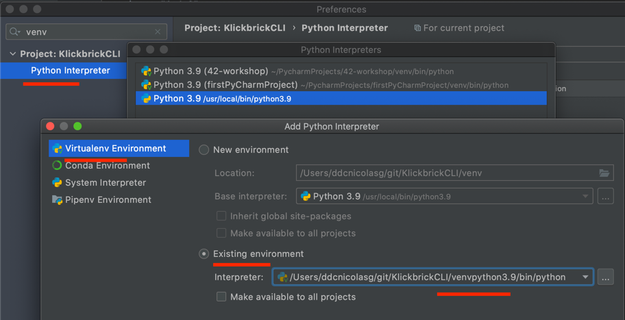

# Introduction
My progress for manning's live project: [Build an Extensible CLI with Python](https://www.manning.com/liveproject/build-an-extensible-cli-with-python)

## todo
- integrate with github actions
- learn more about poetry
- integrate with travis for cli

# local setup after git clone
set current python to ^3.9 (use `pyenv` for instance)
create a virtual env
`$ python -m venv venv`
Check that pycharm use the `venv` interpreter

